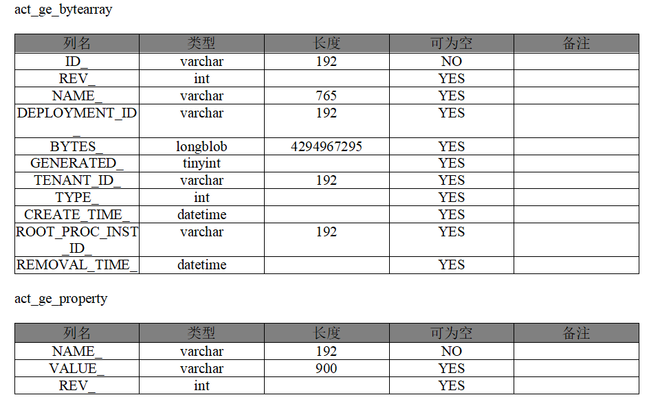

# mysql2docx
MySQL快速生产数据库设计文档

### 使用

1. 查看帮助
``
java -jar mysql2docx-1.0-jar-with-dependencies.jar -h
``
2. 使用:
``
  java -jar mysql2docx -url 'jdbc:mysql://localhost:3306' -username xxx -password xxx -database xxx
``

### 以下是效果
